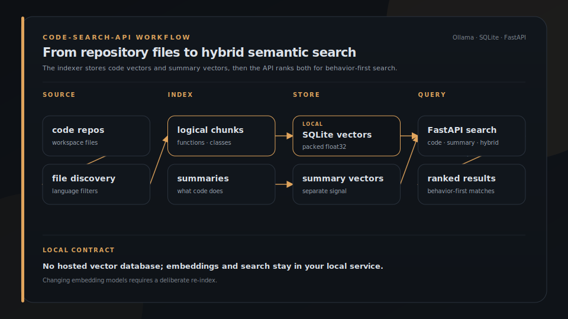

<p align="center">
  
</p>

<h1 align="center">Code Search API</h1>

<p align="center">
  
</p>

<p align="center">
  <strong>Search code by intent, on your machine.</strong>
</p>

<p align="center">
  Local semantic code search with Ollama embeddings, language-aware chunking, SQLite vectors, and hybrid search. FastAPI for agents and tools. Optional GraphTrail blend for structure plus similarity.
</p>

<p align="center">
  <a href="#try-it-in-60-seconds">Quickstart</a> &middot; <a href="#install">Install</a> &middot; <a href="https://brigade.tools/graphtrail">GraphTrail</a>
</p>

<p align="center">
  
  
</p>

## Install

```bash
# see repo docs for full local setup with Ollama
git clone https://github.com/escoffier-labs/code-search-api.git
cd code-search-api
# follow README install for venv + Ollama model pull
```

## What it does

| | Job | What you get |
|---|---|---|
| **Chunk** | Language-aware splits | Not arbitrary line windows |
| **Embed** | Local Ollama vectors | Stored as float32 in SQLite |
| **Search** | Intent, not exact text | Code, summary, or hybrid ranking |
| **Serve** | Small FastAPI surface | Agents and CLIs query locally |


## Install and run

### Option A - install from PyPI

```bash
pipx install code-search-api          # or: pip install code-search-api
ollama pull qwen3-embedding:8b
export CODE_SEARCH_WORKSPACE=/path/to/your/code   # see .env.example for full config
code-search-api index                  # first-time index
code-search-api serve                  # http://localhost:5204
```

### Option B - Docker

```bash
docker run --rm -p 5204:5204 \
  -e CODE_SEARCH_WORKSPACE=/workspace \
  -v /path/to/your/code:/workspace:ro \
  -v code-search-data:/data \
  --add-host host.docker.internal:host-gateway \
  ghcr.io/escoffier-labs/code-search-api:latest
```

A `docker-compose.yml` is included at the repo root for a more typical deployment shape.

### Option C - run from source

```bash
git clone https://github.com/escoffier-labs/code-search-api.git
cd code-search-api
python3 -m venv .venv && source .venv/bin/activate
pip install -e .
cp .env.example .env    # edit CODE_SEARCH_WORKSPACE to point at your repos
source .env
code-search-api index
code-search-api serve
```

### Search

```bash
curl -s -X POST http://localhost:5204/api/search \
  -H "Content-Type: application/json" \
  -d '{"query": "rate limiting middleware", "mode": "hybrid"}'
```

## MCP Server

The read-only MCP server and OpenClaw plugin live in [`mcp/`](./mcp) at
`@solomonneas/code-search-mcp` version 0.2.0. The standalone
`escoffier-labs/code-search-mcp` repository is deprecated in favor of this
directory.

```bash
cd mcp
npm install
npm run build
```

## How It Works



Generated from [`docs/assets/workflows/index-search.json`](docs/assets/workflows/index-search.json) with `plating workflow`.

1. **Chunking**: Files are split at logical boundaries (function/class definitions, not arbitrary line counts). Python, TypeScript, JavaScript, Go, Rust, Markdown, and config files are all handled with language-specific patterns.

2. **Embedding**: Each chunk is embedded with your chosen Ollama model and stored as packed float32 BLOBs in SQLite. No vector database required.

3. **Summarization**: An LLM generates a 1-2 sentence summary per chunk describing what the code *does*, not just what it *contains*. The summary gets its own embedding vector.

4. **Hybrid search**: Queries match against both code embeddings (35% weight) and summary embeddings (65% weight). This means searching "authentication flow" finds auth code even if the word "authentication" never appears in variable names.

## Why not ripgrep, hosted code search, or a vector database?

Use ripgrep or IDE search when you know the exact symbol, string, or file. Use Code Search API when the query is behavioral, such as "authentication flow", and the matching code may not contain the same words. Use a hosted code search product when you want a managed remote index. Use a separate vector database when you need distributed storage or vector infrastructure beyond a local SQLite file.

## What code-search-api is not

Code Search API is not a hosted SaaS, not a replacement for exact text search, not a general-purpose vector database, and not a security scanner or static analyzer. It is a local FastAPI service and CLI for indexing repositories with Ollama embeddings, optional code summaries, and hybrid semantic search.

## Embedding Models

The embedding model is the most important choice. It determines search quality.

**Recommended: `qwen3-embedding:8b`** (what this project was built on)

| Model | Params | VRAM | Quality | Speed | Best For |
|-------|--------|------|---------|-------|----------|
| **qwen3-embedding:8b** | 8B | ~6 GB | ★★★★★ | ★★★☆☆ | Best overall. Strong code + multilingual understanding. **Recommended.** |
| qwen3-embedding:4b | 4B | ~3 GB | ★★★★☆ | ★★★★☆ | Good balance if VRAM is tight |
| qwen3-embedding:0.6b | 0.6B | ~500 MB | ★★★☆☆ | ★★★★★ | Laptop/low-resource environments |
| nomic-embed-text | 137M | ~300 MB | ★★★☆☆ | ★★★★★ | Lightweight, fast, proven. Good starter model. |
| mxbai-embed-large | 335M | ~700 MB | ★★★½☆ | ★★★★☆ | Strong English performance |
| bge-m3 | 567M | ~1 GB | ★★★★☆ | ★★★★☆ | Excellent multilingual support |
| snowflake-arctic-embed2 | 568M | ~1 GB | ★★★★☆ | ★★★★☆ | Strong multilingual, good scaling |
| nomic-embed-text-v2-moe | MoE | ~500 MB | ★★★★☆ | ★★★★☆ | Multilingual MoE, efficient |

Pull your chosen model:

```bash
ollama pull qwen3-embedding:8b    # recommended
# or
ollama pull nomic-embed-text      # lightweight alternative
```

Set it in `.env`:

```
CODE_SEARCH_EMBED_MODEL=qwen3-embedding:8b
```

> **Note:** Changing the embedding model after indexing requires a full re-index since vector dimensions and similarity spaces differ between models.
> The indexer refuses accidental model changes. Set `CODE_SEARCH_ALLOW_MODEL_CHANGE=1` only when you intend to re-stamp the database and re-index with the configured embedding model.

## Summary Models

Summaries are what make hybrid search work. The summarizer reads each code chunk and writes a 1-2 sentence description of what it *does*. That summary gets its own embedding, so you can find code by describing behavior.

**Be realistic about model quality here.** A tiny quantized local model will produce vague, useless summaries like "This file contains code." That defeats the purpose. You need a model that can actually read code and explain it.

### If you have Ollama Pro (cloud models via Ollama)

Best option for bulk code-search summaries. Our April 2026 code-search gauntlet still put `qwen3-coder-next:cloud` first, with `kimi-k2.6:cloud` as the best tested fallback.

| Model | Quality | Speed | Notes |
|-------|---------|-------|-------|
| **qwen3-coder-next:cloud** | ★★★★★ | ★★★★★ | Current default. Best balance of clean summaries, speed, and structure. |
| kimi-k2.6:cloud | ★★★★★ | ★★★★☆ | Best tested fallback. Strong identifier retention, but more verbose. |
| gemma4:31b-cloud | ★★★☆☆ | ★★☆☆☆ | Clean outputs, but lower key-term retention and severe tail latency on code-search summaries. |
| deepseek-v4-flash:cloud | ★★★★☆ | ★★★★☆ | Promising candidate, but needs thinking behavior controlled and had worse tail latency. |
| deepseek-v4-pro:cloud | ★★☆☆☆ | ★☆☆☆☆ | Clean when successful, but rejected for bulk summaries after 7/100 failures, two 180s timeouts, and severe tail latency. |
| deepseek-v3.2:cloud | ★★★☆☆ | ★★☆☆☆ | Reliable, but slower and lower retention in our backfill gauntlet. |
| minimax-m2.7:cloud | ★★☆☆☆ | ★★☆☆☆ | Reject for summaries. Too much empty-content or thinking leakage in this workflow. |

Recent gauntlet results on the same 100 real code/documentation chunks:

| Model | Success | Median | P95 | Key retention | Decision |
|-------|--------:|-------:|----:|--------------:|----------|
| `qwen3-coder-next:cloud` | 100/100 | 1.64s | 3.01s | 0.293 | Primary |
| `kimi-k2.6:cloud` | 100/100 | 2.59s | 4.76s | 0.296 | Fallback |
| `deepseek-v4-flash:cloud` | 100/100 | 1.88s | 14.41s | 0.288 | Candidate only |
| `deepseek-v4-pro:cloud` | 93/100 | 2.29s | 56.24s | 0.218 | Reject |
| `gemma4:31b-cloud` | 100/100 | 2.16s | 31.11s | 0.247 | Reject |

DeepSeek V4 Pro looked clean when it returned, but the April 28 run had five HTTP 503s, two 180s timeouts, lower identifier retention, and a much worse latency tail than Qwen or Kimi. Do not route bulk summary backfills to it unless a future retry shows materially better reliability.

Ollama Pro supports two auth paths:

- Local CLI and localhost API calls can use `ollama signin`.
- Direct hosted calls to `https://ollama.com/api` use `OLLAMA_API_KEY`.

Ollama Pro is a $20/month plan with 3 concurrent cloud models and 50x more cloud usage than Free. Ollama documents cloud usage as infrastructure utilization rather than a fixed token cap, with session limits resetting every 5 hours and weekly limits resetting every 7 days.

### If running local models only

You need at least a 14B+ parameter model to get useful code summaries. Anything smaller will hallucinate function names and produce generic descriptions that don't help search.

| Model | Params | VRAM | Quality | Notes |
|-------|--------|------|---------|-------|
| qwen3:32b | 32B | ~20 GB | ★★★★☆ | Best local option if you have the VRAM |
| qwen3:14b | 14B | ~10 GB | ★★★½☆ | Minimum viable for code summaries |
| codellama:34b | 34B | ~22 GB | ★★★★☆ | Strong code understanding |
| deepseek-coder-v2:16b | 16B | ~11 GB | ★★★½☆ | Decent code summaries |

**Models to avoid for summarization:**

| Model | Why |
|-------|-----|
| Any model < 7B | Summaries will be too vague to improve search |
| Heavily quantized (Q2, Q3) | Quality degrades to the point of being worse than no summary |
| Embedding models | These can't generate text, only vectors |

Set your summary model in `.env`:

```
CODE_SEARCH_SUMMARY_MODEL=qwen3-coder-next:cloud    # Ollama Pro
CODE_SEARCH_SUMMARY_FALLBACK=kimi-k2.6:cloud        # optional cloud fallback
# or
CODE_SEARCH_SUMMARY_MODEL=qwen3:32b                  # local, needs ~20GB VRAM
```

## API Endpoints

| Method | Path | Auth | Description |
|--------|------|------|-------------|
| `GET` | `/health` | No | Liveness check |
| `GET` | `/api/health` | No | Health + index stats (chunks, embedded, summarized) |
| `POST` | `/api/search` | Yes | Semantic search with hybrid, code, or summary mode |
| `POST` | `/api/index` | Yes | Trigger background indexing run |
| `POST` | `/api/backfill-summaries` | Yes | Generate summaries for unsummarized chunks |
| `GET` | `/api/projects` | Yes | Per-project chunk and summary counts |
| `GET` | `/api/stats` | No | Chunk type breakdown and project coverage |
| `GET` | `/api/summary-stats` | Yes | Summary counts by model |

### Search request

```json
{
  "query": "websocket authentication middleware",
  "mode": "hybrid",
  "limit": 10,
  "min_score": 0.3,
  "project": "my-api"
}
```

**Modes:**
- `hybrid` (default): Weighted combination of code + summary similarity. Best for most searches.
- `code`: Raw code embedding match only. Use when searching for exact patterns.
- `summary`: Summary embedding match only. Use when searching by high-level intent.

## Configuration

| Variable | Default | Description |
|----------|---------|-------------|
| `CODE_SEARCH_WORKSPACE` | `./repos` | Root directory to scan for code. Set to an empty string to disable the workspace root and scan only extra roots. |
| `CODE_SEARCH_REFERENCE` | *(unset)* | Optional second directory for reference docs |
| `CODE_SEARCH_EXTRA_SCAN_ROOTS` | *(unset)* | Extra scan roots as `root_id=/abs/path` entries separated by `:` (`os.pathsep`). Projects under an extra root are namespaced `root_id/<dirname>`. |
| `CODE_SEARCH_DB` | `./code_index.db` | SQLite database path |
| `CODE_SEARCH_API_KEY` | *(unset)* | API key for protected endpoints. Unset = no auth. |
| `CODE_SEARCH_CORS_ORIGINS` | `*` | Comma-separated CORS origins |
| `OLLAMA_URL` | `http://localhost:11434` | Ollama API base URL |
| `CODE_SEARCH_EMBED_MODEL` | `qwen3-embedding:8b` | Embedding model |
| `CODE_SEARCH_ALLOW_MODEL_CHANGE` | *(unset)* | Set to `1` to allow re-stamping an existing DB after changing embedding models |
| `CODE_SEARCH_SUMMARY_MODEL` | `qwen3-coder-next:cloud` | Primary summarization model |
| `CODE_SEARCH_SUMMARY_FALLBACK` | `qwen3-coder-next:cloud` | Fallback summarization model |
| `CODE_SEARCH_SUMMARY_WORKERS` | `4` | Parallel summary generation workers |
| `CODE_SEARCH_DB_BATCH_SIZE` | `100` | DB write batch size |
| `CODE_SEARCH_CACHE_TTL_SECONDS` | `3600` | Query embedding cache TTL |

## Helper Scripts

| Script | Purpose |
|--------|---------|
| `code-search-api index` | CLI indexer for first-time or batch re-indexing |
| `index-then-summarize.sh` | Full pipeline: index new chunks, then summarize |
| `backup-db.sh` | Rotated SQLite backup (configurable retention) |

## Supported Languages

Chunking is language-aware for: Python, TypeScript/TSX, JavaScript/JSX, Go, Rust, Markdown, Astro, HTML, CSS, Shell, JSON, YAML, TOML.

Other text files are indexed as flat chunks.

## Requirements

- Python 3.10+
- [Ollama](https://ollama.com) running locally (or on a reachable host)
- An embedding model pulled in Ollama
- ~500 MB to 6 GB VRAM depending on embedding model choice

## License

MIT
